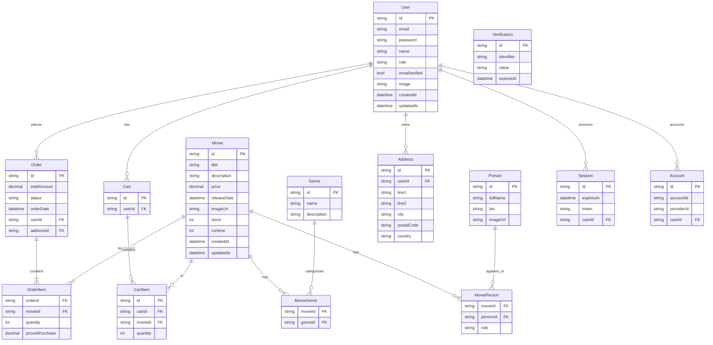

# ERD – MovieShop Database (generated from prisma/schema.prisma)

## Notes

- Enums (from Prisma): `PersonRole` (DIRECTOR | ACTOR), `OrderStatus` (PENDING | PAID | CANCELLED)
- Composite keys: `MovieGenre` (movieId, genreId), `MoviePerson` (movieId, personId, role), `OrderItem` (orderId, movieId)
- Important relations: `MovieGenre`/`MoviePerson` cascade on delete; `OrderItem.movie` uses `onDelete: Restrict`
- Table mappings: `User` model mapped to DB table `user` (via `@@map`), Session/Account/Verification similarly mapped
- Money fields use `Decimal(10,2)` precision in DB

Recommended: run `npx prisma migrate dev` after schema changes and optionally export this Mermaid diagram to PNG/SVG for docs.
