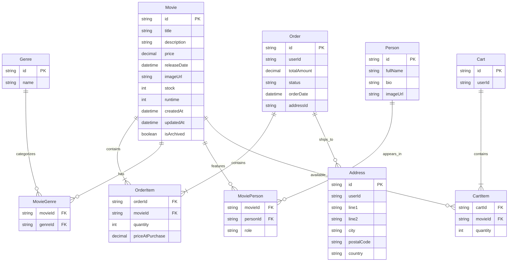

# ERD – MovieShop Database

<!--
  ERD: Entity Relationship Diagram notes for the data model.
-->

Notes:

- Primary keys and composite keys (documented here because Mermaid's ER syntax doesn't support composite-key declarations):

  - MovieGenre composite PK = (movieId, genreId)
  - MoviePerson composite PK = (movieId, personId, role)
  - OrderItem composite PK = (orderId, movieId)
  - CartItem composite PK = (cartId, movieId)

- Optional fields (nullable in Prisma) have been placed in the Notes rather than using `?` in the diagram text because GitHub's Mermaid parser rejects `?` in attributes. Optional fields include:

  - Movie.imageUrl, Movie.runtime
  - Movie.isArchived (boolean flag)
  - Order.addressId
  - Address.line2
  - Cart.userId (nullable; unique when present)

- `Genre.name` and `Person.fullName` are unique.
- `Order.userId` and `Address.userId` are plain strings referencing external user IDs managed by the auth system (Better Auth). There is intentionally no Prisma `User` model relation in this schema.
- Indexes present in the Prisma schema: `@@index([userId])` on `Order` and `Address`.

Rendering notes:

- GitHub's mermaid in Markdown does not accept `?` or `@@id(...)` tokens inside ER attribute lists — use plain attribute names/types and document optional/composite information in Notes (as done above).
- If you want a rendered PNG/SVG included in the repo, I can generate one and add it under `docs/`.

If you'd like any further adjustments (simplified ERD, only public-facing tables, or a PNG output), tell me which models to include and I will produce it.
